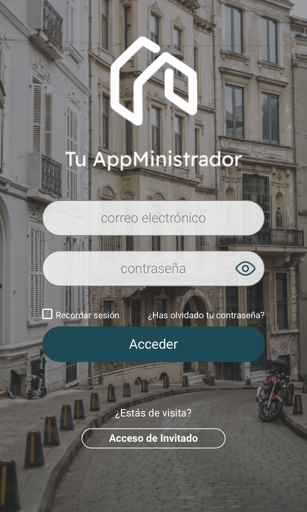
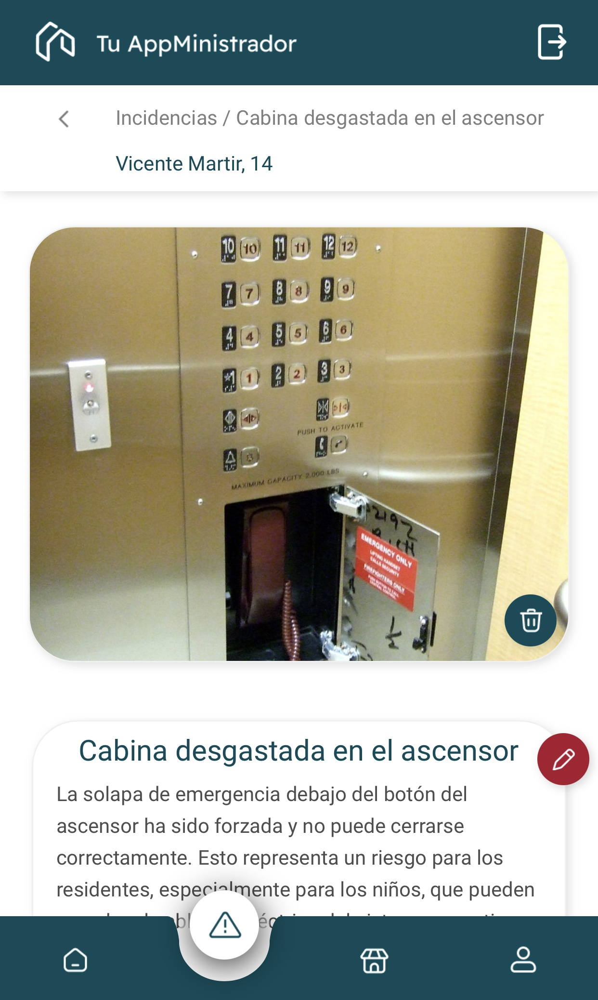
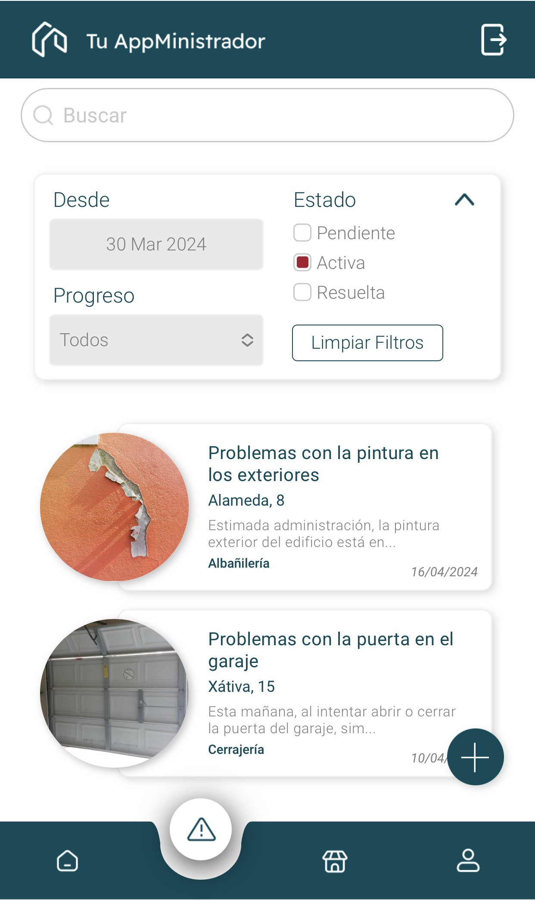
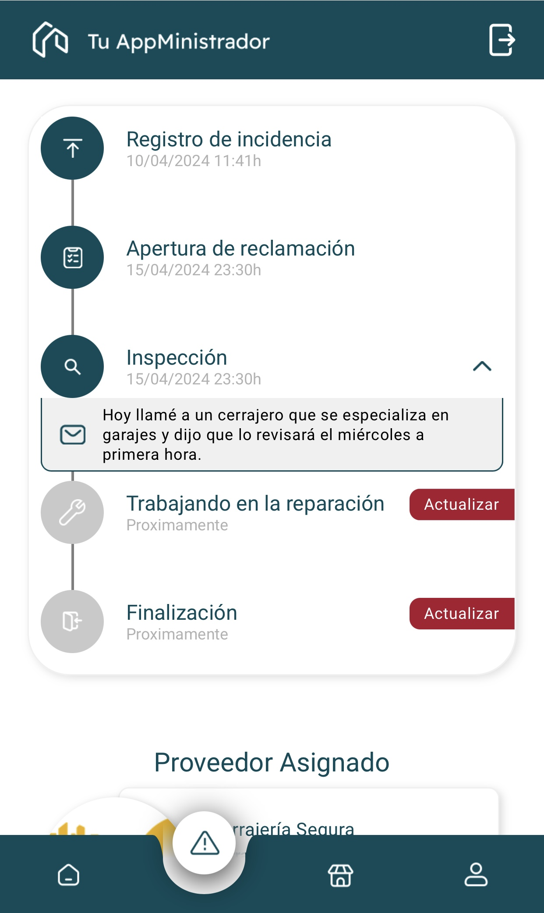

<p align="center"></p>

<h3 align="center">Streamlining Incident Management for Residential Communities</h3>

<details>
  <summary>Table of Contents</summary>
  <ol>
    <li><a href="#overview">Overview</a></li>
      <li><a href="#project-goals">Project Goals</a></li>
      <li><a href="#features">Features</a></li>
      <li><a href="#technologies-used">Technologies Used</a></li>
      <li><a href="#styling-and-design">Styling and Design</a></li>
    <li><a href="project-preview">Project Preview</a></li>
    <li><a href="#using-the-web-app">Using the Web app</a></li>
       <li><a href="#installation">Installation</a></li>
    <li><a href="#future-improvements">Future Improvements</a></li>
  </ol>
</details>

## Overview

Tu Appministrador is more than just an app—it's the missing link that simplifies life for residential administrators and tenants alike. Born out of the need to untangle messy communication, our app creates a streamlined system for handling the chaos of community issues. From a leaky pipe to neighbour disputes, it all gets handled with clarity and efficiency, bringing peace back to the community.

A real-world project requested by the <strong>Colegio de Adminstradores de Fincas—Valencia y Castellón</strong>, our small development team worked tirelessly over a six-week period to bring forth an award-winning solution, chosen by the clients themselves who commended the insight we had shown into creating a solution that is as effective as it is user-friendly.


## Project Goals

<ol>
  <li><strong>Centralized Communication:</strong> Provide a platform for administrators to communicate updates and relevant information to community members, streamlining communication channels.

  <li><strong>Incident Management:</strong> Streamline the process of reporting and managing incidents within communities to ensure timely resolution and avoid duplication of communication.

  <li><strong>Emotion Regulation:</strong> Create a platform where communication between homeowners/tenants and administrators is structured and sanitized to mitigate emotional outbursts and maintain a professional environment.

<li><strong>Efficient Resource Utilization:</strong> Facilitate administrators in finding solutions to incidents by recommending service providers, tracking incident status, and suggesting relevant providers based on incident nature.
</ol>

## Features

<ul>
  <li><strong>All-in-One Incident Management:</strong> Got a problem? Report it in a snap. Every issue—big or small—is recorded and managed within the application, providing a single point of reference for administrators.
  <li><strong>Structured Communication:</strong> Users report incidents via a form, which is reviewed by administrators before being made public, ensuring professional and sanitized communication.
<li><strong>Efficient Resource Allocation:</strong> The application suggests recommended service providers based on incident nature, allows assignment of providers to incidents, and maintains contact details for future reference.
<li><strong>User Notifications:</strong> Users can choose to receive notifications for all incidents or specific ones, ensuring timely updates without overwhelming users with unnecessary information.
<li><strong>Progress Tracking:</strong> No more wondering what’s going on. Get real-time updates on the status of your issue with clear progress markers.
<li><strong>Camera Integration:</strong> Snap a pic of the problem with your phone’s camera and upload it directly through the app, securely stored in the cloud.</li>
</ul>

## Technologies Used

The front end of Tu Appministrador is built using the following technologies:

<ul>
<li><strong>React</strong> (components, contexts, hooks) & <strong>Javascript</strong> ES6+
  
<li>Responsive Design through <strong>CSS, Bootstrap</strong> and <strong>StyledComponents</strong>
  <li><strong>Firebase</strong> Cloud Storage</li>
  <li><strong>Figma</strong> for collaborating with out UX/UI team and Trello for sprint management</li>
</ul>

## Styling and Design

Our UX/UI team gave us the blueprint, and we brought it to life! The app's design is clean and intuitive, built with a mobile-first philosophy while ensuring it looks great on any screen. I personally invested a lot of time and care to ensure the design was respected in future elements, such as:
<ul>
  <li>Interactive Stepper with hideable notes</li>
  <li>Incident Filter</li>
  <li>Login screen</li>
  <li>Loading spinner</li>
</ul>

## Project Preview
<div style="display: flex">




</div>

## Using the Web App
<a href="tuappministrador.vercel.app"><strong>Visit the web app</strong></a>
<ol>
<li>Click "Acceso de Invitado" (Guest login)
<li>The free server may take some time to connect, so please be patient! :)
<li>Once inside, you'll have administrative privileges!
<li>Explore the app, especially the Incidencias section
</ol>

## Installation
To install Tu Appministrador locally, follow these steps:

<ol>
<li>Clone the repository:
  
```bash
git clone https://github.com/nuinn/appministrador_client.git
```
<li>Navigate to the project directory:
  
```bash
cd appministrador_client
```
<li>Install dependencies using npm:

```bash
npm install
```
Or using yarn:

```bash
yarn install
```
<li>Run the development server:

```bash
npm run dev
```
Or with yarn:

```bash

yarn dev
```
<li>Access the application in your web browser at http://localhost:5173.
</ol>

## Future Improvements
<ul>
  <li><strong>Multilingual Support:</strong></li> Expand the app’s reach by adding more languages.
  <li><strong>Detailed Reporting:</strong></li> Create in-depth reports for administrators to analyze incident resolution times and track performance.
  <li><strong>AI-driven Service Suggestions:</strong></li> Implement AI to recommend service providers based on past performance, user reviews, and incident types.
  <li><strong>Offline Capabilities:</strong></li>Allow users to submit incidents even when offline, syncing data when back online.
</ul>

<br>

Feel free to contribute to Tu Appministrador by submitting pull requests or reporting issues on GitHub. Your feedback is valuable in improving the application and addressing community needs effectively.

<br>

<h3 align="center">Licensed and Developed by</h3>

<p align="center">Marc Dilley</p>
<p align="center">
<a href = "mailto:marcdilley@gmail.com"></a>
    <a href="https://www.linkedin.com/in/marc-dilley-288407a1/" target="_blank"></a> 
  <a href="https://github.com/nuinn/"></a>
</p>
<p align="center">Jānis Melderis</p>
<p align="center">
<a href = "mailto:jaanmeld@gmail.com"></a>
    <a href="https://www.linkedin.com/in/jm-24095226/" target="_blank"></a> 
  <a href="https://github.com/jaanmeld"></a>
</p>
<p align="center">Daniel Dawra</p>
<p align="center">
<a href = "mailto:Dawra.daniel@gmail.com"></a>
    <a href="https://www.linkedin.com/in/jm-24095226/](https://www.linkedin.com/in/daniel-dawra-944465167/?utm_source=share&utm_campaign=share_via&utm_content=profile&utm_medium=ios_app)" target="_blank"></a> 
  <a href="https://github.com/danielDAWRA"></a>
</p>
